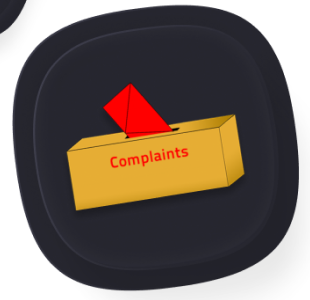
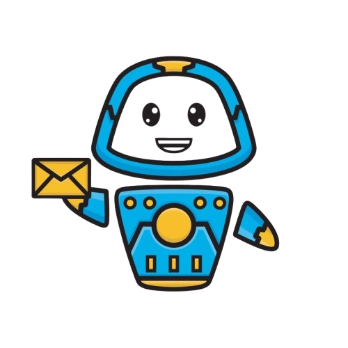

# MTU Connect-Hub

MTU Connect-Hub is a comprehensive student support and complaint management platform designed for Mountain Top University (MTU). The application empowers students to seamlessly submit, track, and resolve issues related to academics, hostels, campus life, and more. It also provides administrators with powerful tools for analytics, user management, and efficient complaint resolution.

---

## Table of Contents
- [Overview](#overview)
- [Features](#features)
- [Technology Stack](#technology-stack)
- [Getting Started](#getting-started)
- [Usage](#usage)
- [Contributing](#contributing)
- [License](#license)
- [Demo](#demo)
- [Advanced Features](#advanced-features)
- [FAQ](#faq)

---

## Overview
MTU Connect-Hub streamlines communication between students and university administration. With a modern, intuitive interface and robust backend, it ensures that every concern is addressed promptly and transparently. The platform includes both main admin and virtual AI assistant modules, making support accessible 24/7.

---

## Features
- **Student Complaint Submission**: File complaints or requests to various university offices (Academic Advisory, Hostel, IT Support, Library, Cafeteria, etc.).
- **Anonymous Reporting**: Option to submit issues anonymously for sensitive matters.
- **Complaint Tracking**: Monitor the status and progress of submitted complaints.
- **Virtual AI Assistant**: Get instant answers and guidance via a conversational AI chatbot.
- **Admin Dashboard**: Visual analytics, category breakdowns, and user management for administrators.
- **Notifications**: Stay updated on complaint status and important announcements.
- **Multi-Department Support**: Dedicated modules for different university offices (Hostel, Healthcare, Technical Support, Student Affairs, etc.).
- **Secure Authentication**: Sign in with email, Google, Apple, or Facebook.
- **Data Export**: Admins can export complaint data as CSV for reporting.
- **Modern UI/UX**: Animated splash screen, dark/light mode, and responsive design.

---

## Demo

Below are some sample UI elements from MTU Connect-Hub:

| Splash Screen | Main Dashboard | Virtual Assistant |
|:------------:|:-------------:|:----------------:|
|  |  |  |

---

## Advanced Features
- **Anonymous Reporting**: Toggle anonymity when submitting sensitive complaints.
- **Image Attachments**: Add supporting images to your complaints for better context.
- **CSV Export**: Admins can export complaint data for offline analysis and reporting.
- **Admin Analytics**: Visualize complaint distribution and status with interactive charts.
- **Role-Based Access**: Separate interfaces and permissions for students and admins.
- **Multi-Platform**: Works on Android, iOS, Web, Windows, MacOS, and Linux.

---

## FAQ

**Q: How can I track my complaint?**
> You can track it in the profile section after logging in.

**Q: Can I submit a complaint anonymously?**
> Yes, toggle the anonymity switch when submitting your complaint.

**Q: What categories can I complain about?**
> There are various categories including academics, hostels, IT, library, cafeteria, and more.

**Q: How long does it take to process a complaint?**
> Processing time varies based on the nature and severity of the complaint.

**Q: Can I attach an image to my complaint?**
> Yes, you can add supporting images when submitting your complaint.

**Q: Will I receive updates on my complaint?**
> Yes, you will be notified via email and in-app notifications.

**Q: How do I use the virtual assistant?**
> Access the Virtual Admin section and chat with the AI assistant for instant help and FAQs.

---

## Technology Stack
- **Flutter** (cross-platform mobile/web)
- **Firebase** (Authentication, Firestore, Storage)
- **Riverpod & Provider** (state management)
- **Google Fonts** (custom typography)
- **fl_chart** (data visualization)
- **DialogFlowtter** (AI chatbot integration)
- **Other**: Shared Preferences, Image Picker, CSV, Path Provider, etc.

---

## Getting Started

### Prerequisites
- [Flutter SDK](https://flutter.dev/docs/get-started/install)
- [Firebase CLI](https://firebase.google.com/docs/cli) (for backend features)
- A configured Firebase project (see `firebase.json` and `firebase_options.dart`)

### Installation
1. **Clone the repository:**
   ```bash
   git clone <repo-url>
   cd mtu_connect_hub
   ```
2. **Install dependencies:**
   ```bash
   flutter pub get
   ```
3. **Configure Firebase:**
   - Add your `google-services.json` (Android) and `GoogleService-Info.plist` (iOS) to the respective directories if not present.
   - Update `firebase_options.dart` if needed.
4. **Run the app:**
   ```bash
   flutter run
   ```

---

## Usage
- **Students**: Register or sign in, select the relevant office, and submit your complaint or request. Track progress and communicate with admins as needed.
- **Admins**: Access the dashboard for analytics, manage user complaints, reply, and export data.
- **Virtual Assistant**: Use the chatbot for quick help, FAQs, and guidance.

---

## Contributing
Contributions are welcome! Please open an issue or submit a pull request for improvements, bug fixes, or new features.

---

## License
This project is licensed for educational and non-commercial use at Mountain Top University. For other uses, please contact the project maintainers.

---

## Acknowledgements
- [Flutter](https://flutter.dev/)
- [Firebase](https://firebase.google.com/)
- [Riverpod](https://riverpod.dev/)
- [Dialogflow](https://dialogflow.cloud.google.com/)
- [Google Fonts](https://fonts.google.com/)

---

For more information, see the in-app About section or contact the MTU ICT department.
